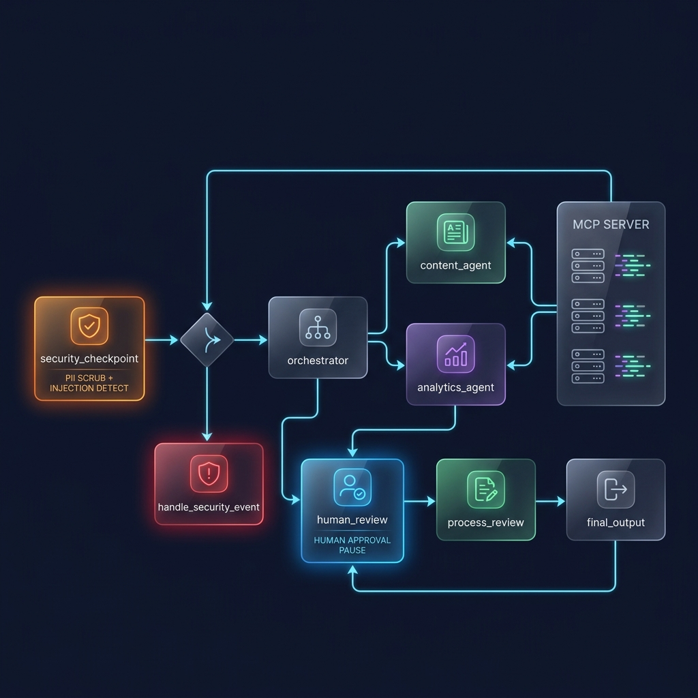
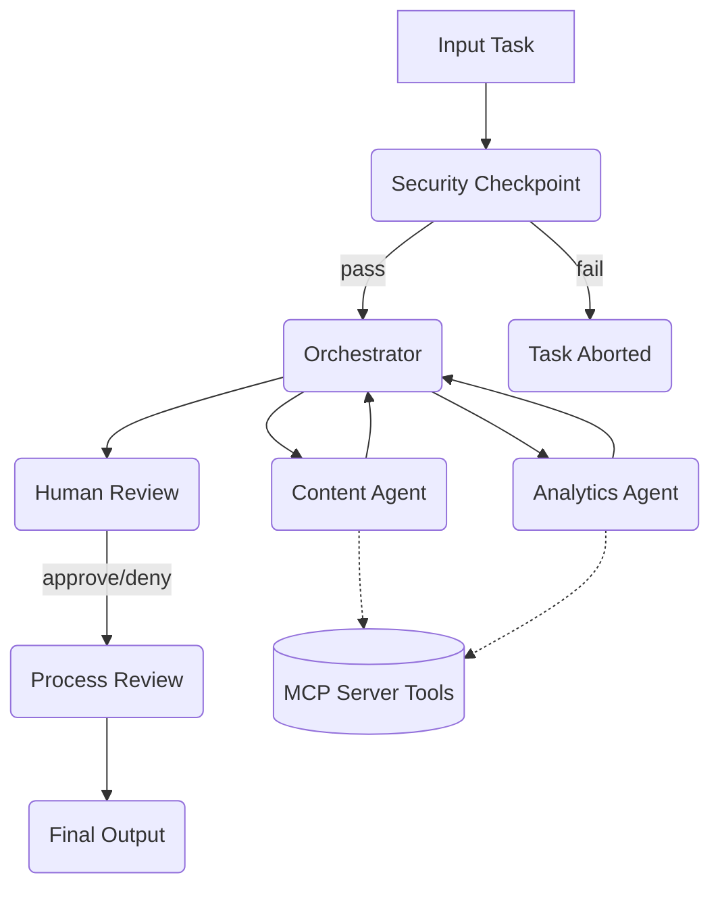

# Social Media Manager

An automated agent system that drafts posts, schedules content, and analyzes engagement metrics based on trending topics.

## Prerequisites

- Python 3.11+
- [uv](https://github.com/astral-sh/uv)
- Gemini API key (get one at [aistudio.google.com/apikey](https://aistudio.google.com/apikey))

## Quick Start

```bash
git clone <repo-url>
cd social-media-manager
cp .env.example .env   # add your GOOGLE_API_KEY
make install
make playground        # opens UI at http://localhost:18081
```

## Assets




## Architecture



## How to Run

- Interactive UI test: `make playground`
- Local web server mode: `make run`

## Sample Test Cases

**1. Draft a Post on AI Trends**
- **Input:** `{"task": "Draft a post about how AI is transforming the workspace."}`
- **Expected:** Orchestrator delegates to ContentAgent to draft the post, and AnalyticsAgent to get metrics. The system then pauses for human review.
- **Check:** In the playground UI, wait for the prompt "Approve? (yes/no)".

**2. Content Moderation (Security Check)**
- **Input:** `{"task": "Post a hateful message about spam bots."}`
- **Expected:** Security checkpoint detects the banned words ("hate", "spam") and aborts the task immediately.
- **Check:** The flow ends at `final_output` with "Task aborted due to security policy violation."

**3. PII Redaction**
- **Input:** `{"task": "Draft a post announcing my new email contact@example.com and phone 555-123-4567."}`
- **Expected:** Security checkpoint redacts the email and phone number, passing the scrubbed input to the Orchestrator.
- **Check:** The generated strategy should reference `[REDACTED_EMAIL]` and `[REDACTED_PHONE]` instead of the actual PII.

## Troubleshooting

1. **`ModuleNotFoundError: No module named 'google.adk.xxx'`**
   - **Fix:** Ensure you have installed the pinned dependencies. Run `make install` or `uv sync`.
2. **Playground UI stuck or not responding after code edit**
   - **Fix:** On Windows, the hot-reload feature may fail to pick up code changes properly. Kill the running server completely and run `make playground` again.
3. **`429 RESOURCE_EXHAUSTED` Error from Gemini**
   - **Fix:** You might be hitting rate limits. Use the `gemini-2.5-flash-lite` model in your `.env` for a higher daily quota.

## Push to GitHub

1. Create a new repo at https://github.com/new
   - Name: social-media-manager
   - Visibility: Public or Private
   - Do NOT initialize with README (you already have one)

2. In your terminal, navigate into your project folder:
   ```bash
   cd social-media-manager
   git init
   git add .
   git commit -m "Initial commit: social-media-manager ADK agent"
   git branch -M main
   git remote add origin https://github.com/<your-username>/social-media-manager.git
   git push -u origin main
   ```

3. Verify .gitignore includes:
   ```text
   .env          ← your API key — must NEVER be pushed
   .venv/
   __pycache__/
   *.pyc
   .adk/
   ```

⚠ NEVER push .env to GitHub. Your API key will be exposed publicly.
