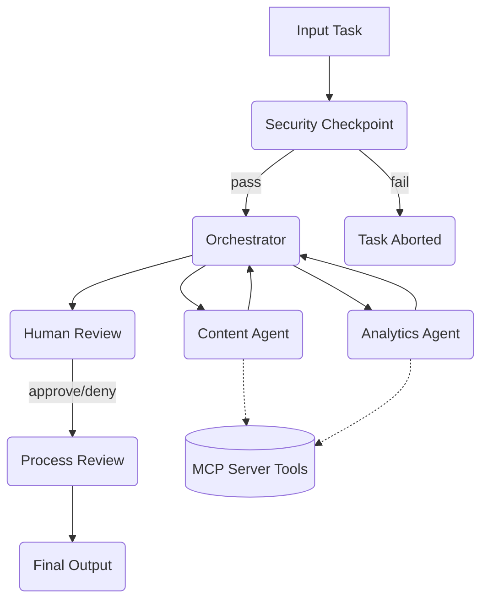

# Social Media Manager - Submission Write-Up

## Problem Statement
Managing a social media presence across multiple platforms requires constant monitoring of trends, creating engaging content, and analyzing complex engagement metrics. This process is time-consuming and often fragmented. The Social Media Manager agent solves this by automating content drafting and metrics analysis securely.

## Solution Architecture
The solution uses a multi-agent workflow orchestrated by an ADK 2.0 graph. An Orchestrator coordinates specialized agents: the ContentAgent drafts posts and the AnalyticsAgent fetches metrics. The system uses an MCP server for domain-specific tools (trending hashtags, scheduling, metrics) and includes a human-in-the-loop review step before any strategy is finalized. 

## Concepts Used
- **ADK Workflow**: Structured the app as a directed graph in `app/agent.py` using `Workflow`.
- **LlmAgent**: Specialized agents (`ContentAgent`, `AnalyticsAgent`, `Orchestrator`) defined with tailored instructions and `config.model`.
- **AgentTool**: Used by the Orchestrator to securely delegate tasks to the sub-agents.
- **MCP Server**: Defined in `app/mcp_server.py`, exposing tools over stdio transport.
- **Security Checkpoint**: Implemented as the entry-point node `security_checkpoint()`.
- **Agents CLI**: Scaffolded the project structure and provided the `make playground` testing environment.

## Security Design
1. **PII Scrubbing**: Regex patterns automatically redact email addresses and phone numbers to prevent sensitive data leakage.
2. **Prompt Injection Detection**: Scans for keywords like "ignore previous instructions" or "override" and aborts the task if detected.
3. **Content Filtering**: Blocks requests containing banned words (e.g., hate, violence, spam).
4. **Audit Logging**: Structured JSON logs are emitted on every decision with severities (`INFO`, `WARNING`, `CRITICAL`), ensuring a trace exists for all automated actions.

## MCP Server Design
The `SocialMediaMCP` server exposes three critical domain tools:
1. `get_trending_hashtags`: Fetches trending tags relevant to the user's topic. Used by the ContentAgent.
2. `get_competitor_metrics`: Retrieves simulated engagement rates and impressions. Used by the AnalyticsAgent.
3. `schedule_post`: Simulates the action of publishing a post. Used by the ContentAgent.

## HITL Flow
Human-in-the-loop (HITL) is implemented via the `RequestInput` mechanism. After the orchestrator generates a comprehensive strategy, the `human_review` node pauses execution. The user is presented with the drafted strategy and asked to explicitly "Approve? (yes/no)". This ensures no content goes live without human oversight.

## Demo Walkthrough
1. **Drafting a Post**: Sent the input `{"task": "Draft a post about how AI is transforming the workspace."}`. The workflow passed the security check, the Orchestrator routed the request to the Content and Analytics agents, and paused for approval.
2. **Content Moderation**: Sent an input containing banned words ("spam"). The security checkpoint immediately intercepted it and aborted the flow, generating a `CRITICAL` audit log.
3. **PII Redaction**: Sent an input with an email address. The system successfully replaced it with `[REDACTED_EMAIL]` before the LLM could process it, generating a `WARNING` audit log.

## Impact / Value Statement
By automating the tedious aspects of social media management while retaining crucial human oversight, businesses can maintain an active, engaging online presence with a fraction of the effort. The integrated security controls guarantee that brand safety and user privacy are prioritized by default.
